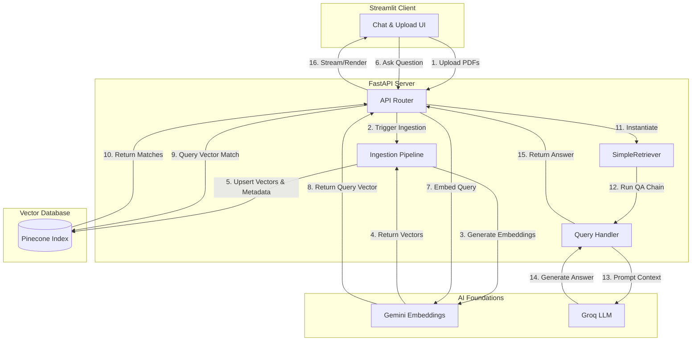

# 🩺 AI Medical Assistant (RAG)

An advanced Retrieval-Augmented Generation (RAG) system for querying medical documents and clinical PDFs. This repository provides a complete, modern application composed of a **FastAPI backend** and an interactive **Streamlit frontend**.

---

## 🏗️ Architecture & Data Flow

This application is built on a modular, decoupled architecture:
1. **Frontend (Client)**: A Streamlit-based web application providing a dynamic chat UI, sidebar document upload, and chat history export.
2. **Backend (Server)**: A FastAPI service serving REST API endpoints. It manages ingestion, queries vector storage, orchestrates LangChain pipelines, and fetches responses from Groq LLMs.
3. **Database (Pinecone)**: A managed serverless vector database used to store document embeddings and metadata for similarity search.

### System Diagram



### 1. Document Ingestion Flow
1. **Upload**: PDFs are uploaded via the Streamlit UI, which sends them to the backend endpoint `/api/upload_pdfs`.
2. **Text Extraction**: The PDF content is loaded using LangChain's `PyPDFLoader` and split into smaller chunks (500 characters, 100 character overlap) using `RecursiveCharacterTextSplitter`.
3. **Vector Generation**: Text chunks are embedded using Google GenAI's `gemini-embedding-001` model.
4. **Storage**: Vector representations along with raw text and source metadata are stored in a Pinecone index.

### 2. Retrieval QA / Query Flow
1. **Query Input**: The user sends a text question to the `/api/ask` endpoint.
2. **Embedding & Similarity Search**: The query text is converted to a vector embedding using `gemini-embedding-001`. A similarity search is performed against Pinecone to retrieve the top `k` matching document chunks.
3. **Context Construction**: Retreived matches are formatted into LangChain `Document` objects and injected into a custom `SimpleRetriever`.
4. **LLM Generation**: A customized LangChain `RetrievalQA` chain routes the user query and the retrieved context to Groq's `llama-3.1-8b-instant` model.
5. **Answer Delivery**: The formatted, context-constrained response is returned to the frontend and rendered.

---

## 📂 Repository Structure

```
├── .agents/                    # Local AI agent skills and configurations
├── client/                     # Streamlit frontend application
│   ├── components/
│   │   ├── chatUI.py           # Chat interface and message flow
│   │   ├── history_download.py # Chat history text export button
│   │   └── upload.py           # Sidebar PDF uploader component
│   ├── utils/
│   │   └── api.py              # API integrations to backend FastAPI
│   ├── app.py                  # Streamlit application main entry point
│   ├── config.py               # Streamlit application environment configurations
│   └── requirements.txt        # Client-side Python dependencies
│
├── server/                     # FastAPI backend application
│   ├── middlewares/
│   │   └── exception_handler.py # Global unhandled exception middleware
│   ├── modules/
│   │   ├── llm.py              # LangChain & Groq integration
│   │   ├── load_vectorstore.py # PDF processing & Pinecone upsertion pipeline
│   │   ├── pdf_handlers.py     # Local PDF saving utilities
│   │   └── query_handlers.py   # LangChain chain query execution
│   ├── routes/
│   │   ├── ask_question.py     # '/api/ask' query endpoint
│   │   └── uplaod_pdfs.py      # '/api/upload_pdfs' ingestion endpoint
│   ├── .env.example            # Environment variables configuration template
│   ├── logger.py               # Logging configuration
│   ├── main.py                 # FastAPI application main entry point
│   ├── requirements.txt        # Server-side Python dependencies
│   └── test.py                 # Simple endpoint test script
│
├── .gitignore                  # Git ignored files & directories config
├── pyproject.toml              # Project dependencies configuration
└── README.md                   # Project documentation (this file)
```

---

## 🚀 Getting Started

### Prerequisites
Make sure you have the following installed:
* **Python 3.13+**
* API Keys for the following platforms:
  * [Google AI Studio](https://aistudio.google.com/) (for Gemini embeddings)
  * [Groq Console](https://console.groq.com/) (for LLM model inference)
  * [Pinecone Console](https://www.pinecone.io/) (for Serverless Vector Database)

---

### Setup and Installation

#### 1. Setup Virtual Environment
Create and activate a virtual environment at the root of the project:
```bash
# Create virtual environment
python -m venv .venv

# Activate virtual environment
# On Windows:
.venv\Scripts\activate
# On macOS/Linux:
source .venv/bin/activate
```

#### 2. Configure Environment Variables
Copy the server environment template and add your credentials:
```bash
cp server/.env.example server/.env
```
Open `server/.env` and update the values with your actual API keys:
```env
GOOGLE_API_KEY=your_google_gemini_api_key_here
GROQ_API_KEY=your_groq_api_key_here
PINCONE_API_KEY=your_pinecone_api_key_here
PINECONE_INDEX_NAME=medicalindex
```
> [!IMPORTANT]
> The environment variable for the Pinecone API key is spelled **`PINCONE_API_KEY`** (without the middle 'e') to match the codebase configuration.

---

### Running the Application

This application requires running both the backend server and the frontend client concurrently.

#### 1. Start the FastAPI Server
Open a terminal, activate your virtual environment, and navigate to the `server/` directory:
```bash
# Install server dependencies
pip install -r server/requirements.txt

# Start the FastAPI server using Uvicorn
uvicorn main:app --reload --port 8000
```
The server API will be running locally at `http://127.0.0.1:8000`. You can inspect the Swagger API documentation at `http://127.0.0.1:8000/docs`.

#### 2. Start the Streamlit Client
Open a second terminal, activate the virtual environment, and navigate to the `client/` directory:
```bash
# Install client dependencies
pip install -r client/requirements.txt

# Start the Streamlit application
streamlit run app.py
```
The client UI will automatically open in your default browser at `http://localhost:8501`.

---

## 🛠️ Verification & Testing

To quickly verify that the FastAPI backend is running and accepting HTTP requests, run the test script:
```bash
# Run the test endpoint script
python server/test.py
```
Or query the endpoint using `curl`:
```bash
curl http://127.0.0.1:8000/
```
Expected output:
```json
{"message": "Test endpoint is working!"}
```
